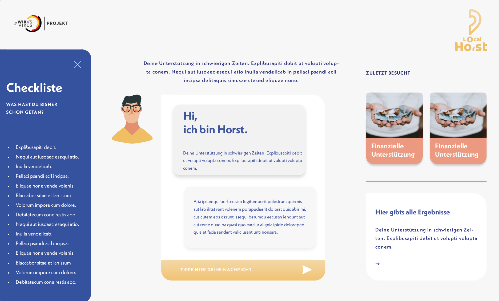
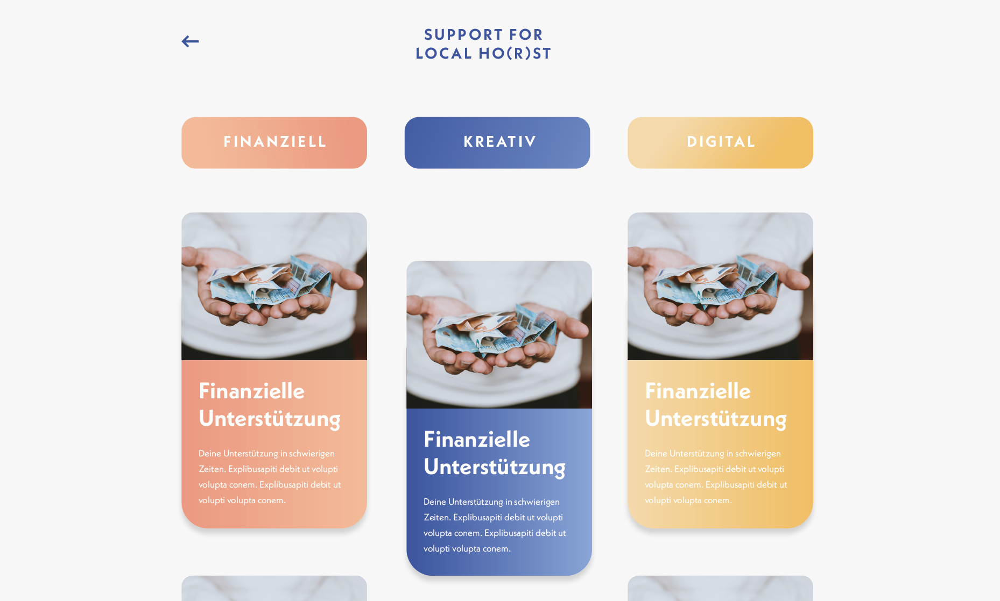
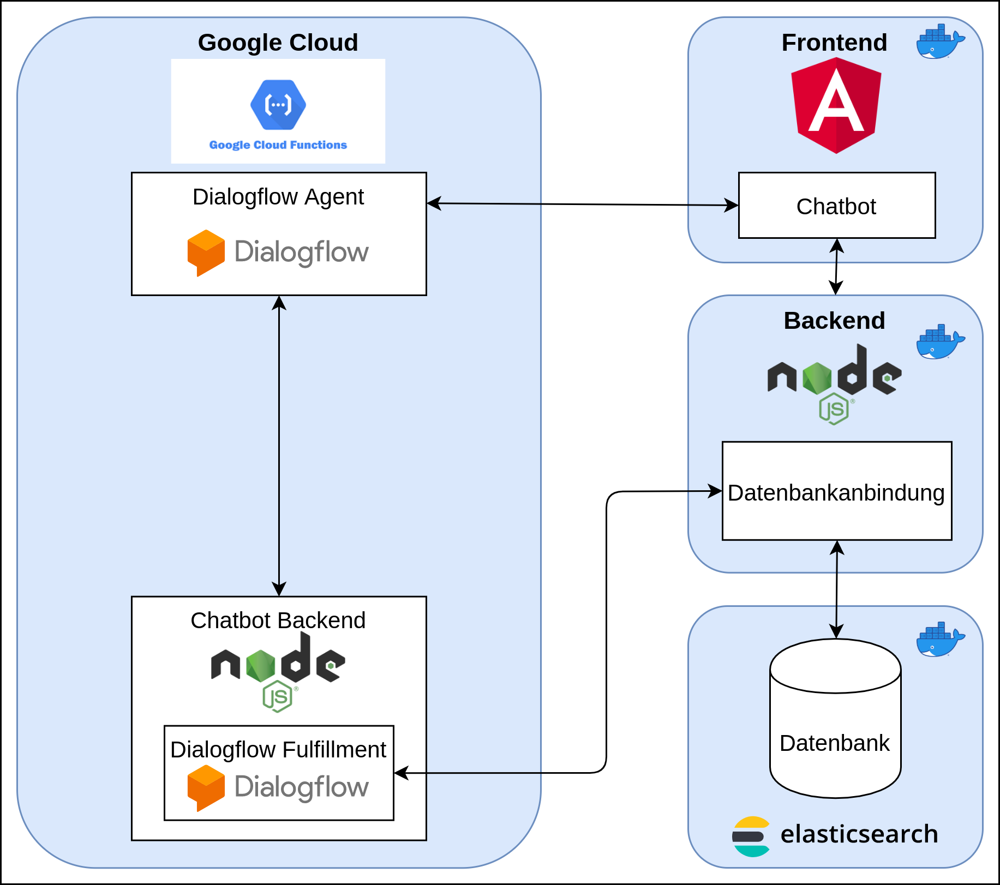

# Localhorst Frontend
This  Repository contains the source code for the frontend, which is hosted at [https://support-for-localhorst.philenius.de/](https://support-for-localhorst.philenius.de/).





## About

This project was develop during the [#wirvsvirus](https://wirvsvirushackathon.org/) hackathon. The whole idea and project is described
 in [devpost](https://devpost.com/software/1_016_a_lokale_unternehmen_support_your_localho-r-st).

## Angular Project Structure
The source code itself is structured into the follwoing directorys:
- models: contains data models
- pages: contains the components that build up a single page
- services: contains the used serives
- shared-components: contains components that are used inside multiple pages

## Dependencies
The project uses [Angular Material](https://material.angular.io/) and [Material Icons](https://material.io/resources/icons/?style=baseline).
The chatbot UI is build using components of the [kendo angular ui](https://www.telerik.com/kendo-angular-ui/components/conversationalui/integrations/dialogflow/) framework, which we re-styled to achieve the look and feel fitting to the rest of the website.

## Build
The project is build using Angular, packed into Docker. The Angular README and manual can be found [here](/app/README.md).

This is how to build the Docker image:
```bash
docker build -t supportforlocalhorst/localhorst-frontend .
```

You can find the pre-built Docker image on [DockerHub](https://hub.docker.com/repository/docker/supportforlocalhorst/localhorst-frontend).

## Full Deployment of _Support For Localho(r)st_ Project

Please refer to the [README of the backend implementation](https://github.com/Social-Developers-Club/localhorst-backend#full-deployment-of-support-for-localhorst-project) on how to deploy _Support For Localho(r)st_. There you can find a detailed explanation on how to deploy the whole application stack using Docker Compose.


## Architecture


## Related-Repositories
- [localhorst-backend](https://github.com/Social-Developers-Club/localhorst-backend)
- [localhorst-chatbot-backend](https://github.com/Social-Developers-Club/localhorst-chatbot-backend)
